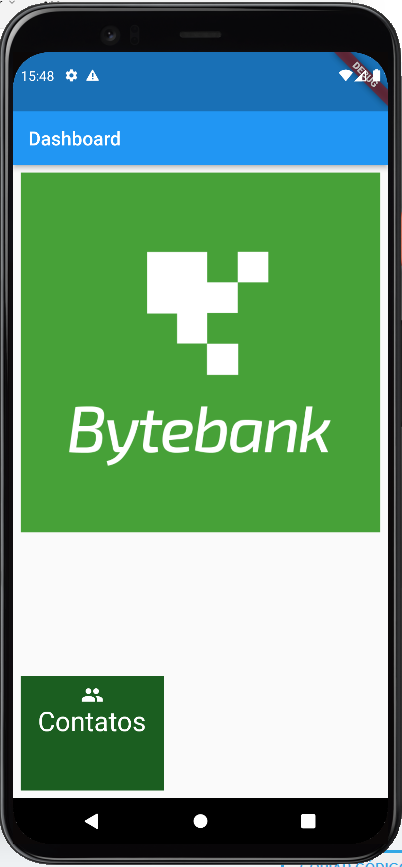
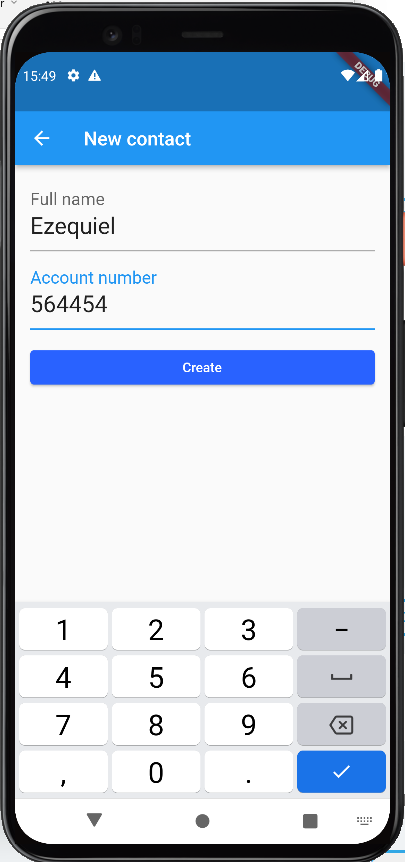
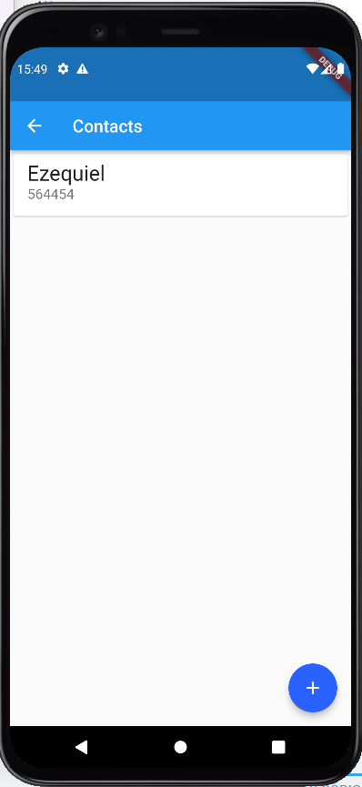

# Apresentação

Programa exemplo desenvolvido em Flutter.
É uma hibrida para cadastro de contato, nome e conta, persistindo em um banco de dados no equipamento, sqlite.

# Requisitos

Para executar o programa é necessário:

* Ter instalado o sdk do Flutter baixado no seu sistema operacional. 
* [online documentation](https://docs.flutter.dev/)
* [Lab: Write your first Flutter app](https://docs.flutter.dev/get-started/codelab)
* [Cookbook: Useful Flutter samples](https://docs.flutter.dev/cookbook)

# Recursos abordados

* Widgets.
* Listas.
* Sqlite.
* Navegação entre paginas.
* Floatbutton.

# Compilar e roda

Abrir pelo IntelliJ ou Android Studio e rodar em um emulador ou em próprio equiapmento mobile.

# Imagens do programa

